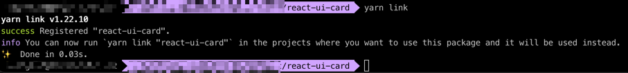
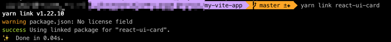

- rollup 中文文档
https://www.rollupjs.com/
```
$: yarn init -y
$: yarn add rollup rollup-plugin-babel @babel/core @babel/preset-env @babel/preset-react @emotion/babel-preset-css-prop -D
```

```
$: yarn add styled-components 有问题
$: yarn add @emotion/core
```


yarn run rollup --config 简写 yarn run rollup -c


# 如何调试我们本地的包
在react-ui-card的根目录下 执行 yarn link



如在要在b项目内调试我们的包,那么就在b项目的根目录下执行 yarn link react-ui-card



查看npm配置的地址： npm config get registry
```
$: npm config set registry https://registry.npmjs.org
```

发布: yarn publish


https://styled-components.com/